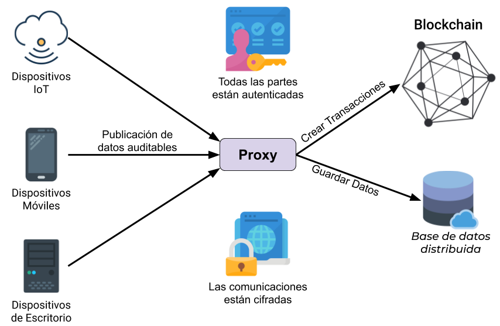

# Trabajo Fin de Grado - Facultad de Informática de la Universidad de Murcia
## Middleware de seguridad para Blockchain en escenarios IoT
En este repositorio se dispone del código fuente de la implementación realiza para lograr el TFG junto con la memoria descriptiva y la presentación.

La estructura del repositorio es la siguiente:

* **Códigos:** Directorio con el código fuente de todo lo que se ha desarrollado.
  * **BNA:** Directorio con el código de la BNA.
  * **Java:** Directorio con el código Java del BSH y de los clientes.
* **Documento:** Directorio con la memoria y la presentación.
* **Esquemas:** Directorio con los esquemas más representativos.

### Resumen
En la actualidad estamos viviendo uno de los cambios más importantes de nuestra historia, está comenzando el inicio de la digitalización de la sociedad. Este proceso se ha acelerado gracias a la tecnología IoT (Internet of Things - Internet de las Cosas), su intención es que cualquier aparato disponga de pequeños ordenadores en su interior para ser capaz de acceder a Internet y comunicar los datos que producen. Esta tecnología permitirá saber en tiempo real los datos de decenas de sensores y dispositivos en instalaciones amplias (fábricas, hogares, ciudades, etc...) desde cualquier parte del mundo.

Aun así, el uso de nuevas tecnologías abre la puesta a nuevos retos y problemas, y la tecnología IoT no está exenta de ellos. Uno de los mayores retos de esta tecnología es todo lo relacionado con la seguridad y la privacidad, dado el gran número de dispositivos que integran las redes IoT, se debe gestionar de forma eficiente protocolos de seguridad que permitan proteger tanto a los dispositivos en sí como a la propia red de ataques de distinta índole, además, se debe respetar la privacidad de los datos de los usuarios que participan manteniendo sistemas de cifrado con diversas técnicas.

En el presente documento se tratarán varias propuestas para afrontar estos retos, realizando una plataforma para proporcionar un servicio de persistencia de datos seguro, auditable y escalable. El servicio deberá ofrece un canal de comunicación encriptado y autenticado con una blockchain, y también deberá ofrecer la funcionalidad necesaria para gestionar las transacciones y realizar el proceso de autenticación.

Para realizar la solución propuesta se hará uso de la tecnología Blockchain de Hyperledger, junto con IPFS y un servicio proxy REST denominado BSH (Blockchain Security Handler). Gracias a estas tecnologías se creará un sistema compuesto por una blockchain para registrar transacciones, un nodo IPFS para persistir los datos de forma distribuida y un BSH que sirve de punto de acceso ligero y seguro para multitud de dispositivos clientes. En la siguiente figura se muestra el esquema simplificado del sistema que se realizará.

Además, en el documento se realizará un estado del arte que servirá para contextualizar el desarrollo de la solución explicando las tecnologías e investigaciones actuales que traten con algún tema de interés para el mismo.
